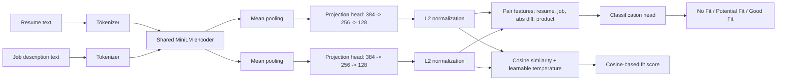
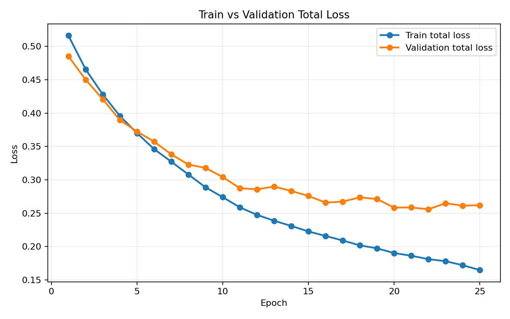
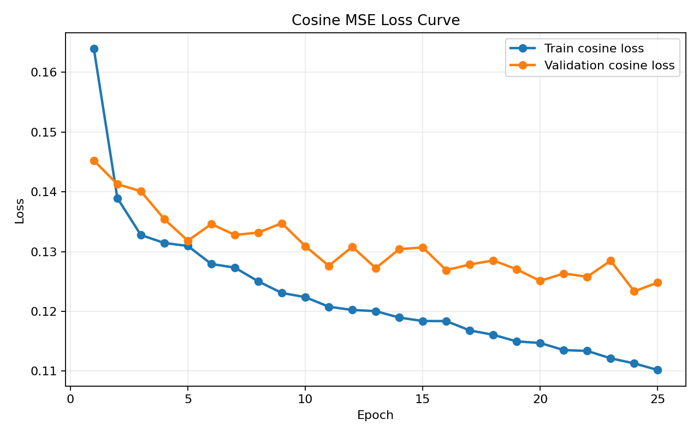
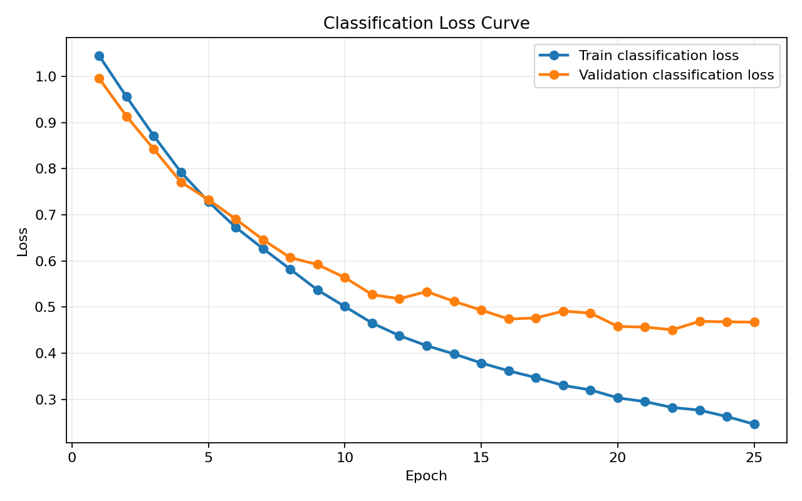
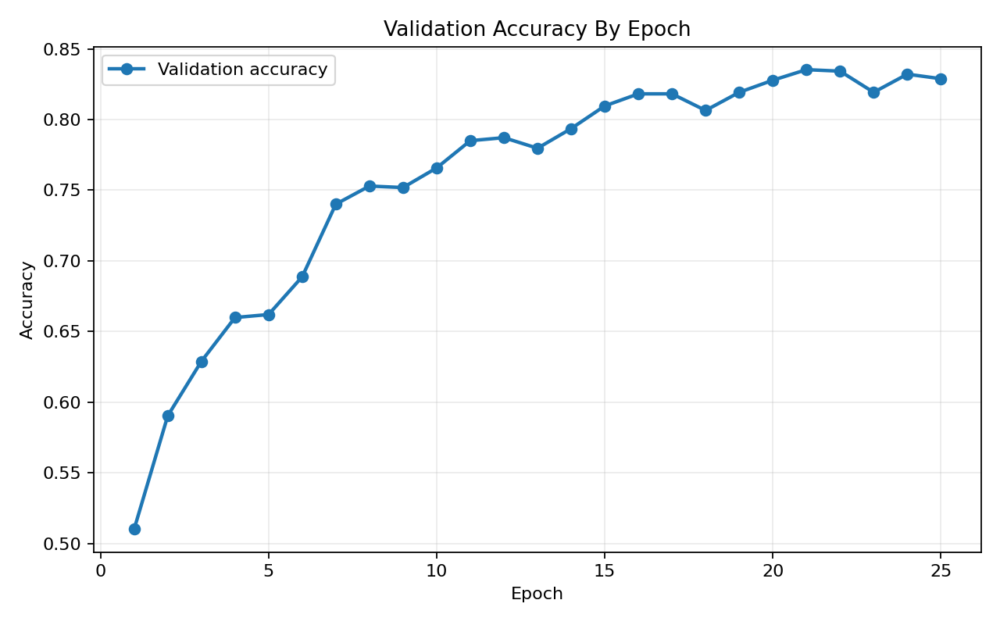
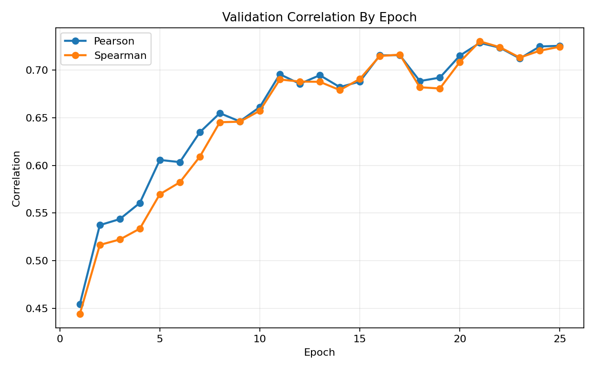
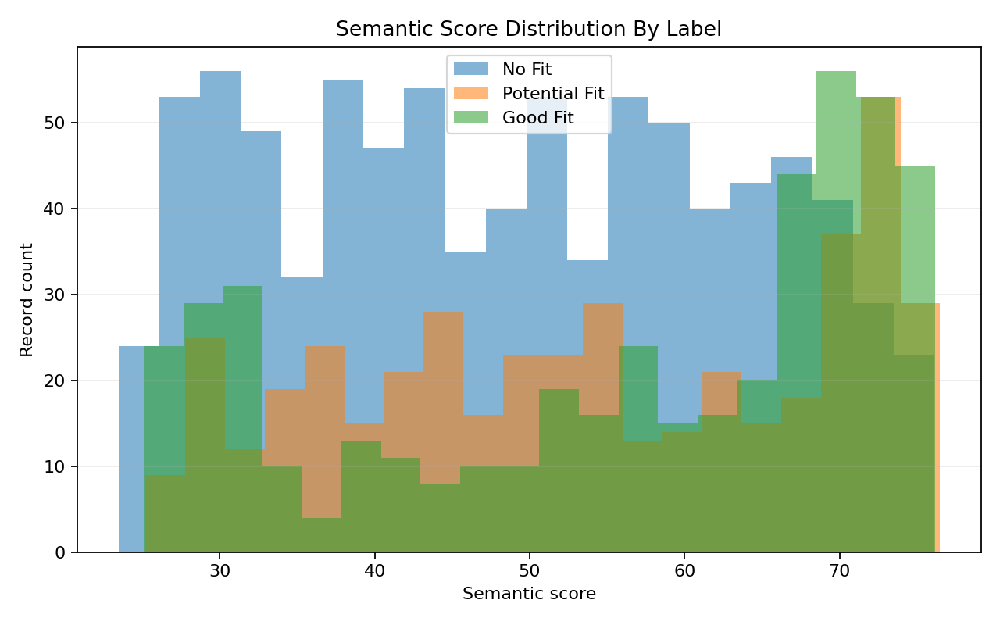
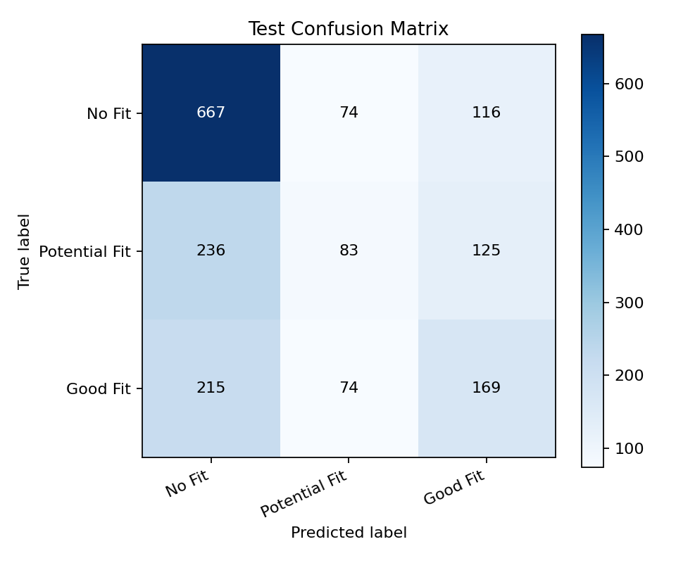

# Results: HR-Oriented Explainable Resume-Job Matching System

## Final Runtime Model

The final runtime model is the custom bi-encoder:

```text
models/resume-job-biencoder-optimal/
```

It was initialized from local pretrained MiniLM weights:

```text
models/base-minilm/
```

## Architecture



Main components:

- Shared encoder-only MiniLM backbone
- Mean pooling over token embeddings
- Projection head: `Linear(384 -> 256) + GELU + Dropout + Linear(256 -> 128)`
- L2-normalized resume and job embeddings
- Cosine similarity with a learnable temperature parameter
- Classification head over `[resume_emb, job_emb, abs(resume_emb - job_emb), resume_emb * job_emb]`

## Dataset

Main dataset:

```text
cnamuangtoun/resume-job-description-fit
```

Local files:

```text
data/raw/cnamuangtoun_resume_job_description_fit/train.csv
data/raw/cnamuangtoun_resume_job_description_fit/test.csv
```

Dataset size:

| Split | Rows |
|---|---:|
| Train | 6,241 |
| Test | 1,759 |
| Total | 8,000 |

The train split was divided into stratified training and validation subsets with seed `42`. The original test split was kept untouched for final evaluation.

| Subset | Rows |
|---|---:|
| Train subset | 5,306 |
| Validation subset | 935 |
| Test split | 1,759 |

## Training Configuration

| Setting | Value |
|---|---|
| Architecture | ResumeJobBiEncoder |
| Base model | `models/base-minilm/` |
| Epoch limit | 25 |
| Batch size | 8 |
| Learning rate | 2e-5 |
| Max sequence length | 256 |
| Validation ratio | 0.15 |
| Seed | 42 |
| Device | CUDA GPU |
| Loss | `0.6 * cosine_mse_loss + 0.4 * classification_cross_entropy` |
| Selection metric | Lowest validation total loss |

Training artifacts:

```text
reports/biencoder_training_config.json
reports/biencoder_training_history.csv
reports/biencoder_optimal_selection.json
```

## Optimal Epoch Selection

The best checkpoint was selected by minimum validation total loss:

| Selected Epoch | Validation Total Loss |
|---:|---:|
| 22 | 0.2558 |

Best validation rows:

| Epoch | Train Loss | Validation Loss | Validation Accuracy | Validation Pearson | Validation Spearman |
|---:|---:|---:|---:|---:|---:|
| 22 | 0.1810 | 0.2558 | 0.8342 | 0.7236 | 0.7242 |
| 20 | 0.1901 | 0.2583 | 0.8278 | 0.7153 | 0.7086 |
| 21 | 0.1861 | 0.2585 | 0.8353 | 0.7287 | 0.7303 |
| 24 | 0.1719 | 0.2612 | 0.8321 | 0.7249 | 0.7205 |
| 25 | 0.1646 | 0.2619 | 0.8289 | 0.7256 | 0.7247 |

Interpretation:

- Training loss continued to decrease until epoch 25.
- Validation loss improved strongly until the low-20 epoch range.
- Epochs 23-25 did not improve validation loss, so selecting epoch 22 avoids using the last and more overfit checkpoint.
- This gives the project a proper validation-based model selection process instead of manually picking an arbitrary number of epochs.

## Training Plots











## Final Test Evaluation

Final evaluation was run on the untouched test split:

```text
records: 1,759
```

| Metric | Value |
|---|---:|
| Classification accuracy | 0.5225 |
| Semantic Pearson | 0.2024 |
| Semantic Spearman | 0.2150 |

Confusion matrix labels:

```text
No Fit, Potential Fit, Good Fit
```

| True \ Predicted | No Fit | Potential Fit | Good Fit |
|---|---:|---:|---:|
| No Fit | 667 | 74 | 116 |
| Potential Fit | 236 | 83 | 125 |
| Good Fit | 215 | 74 | 169 |

Average cosine-based semantic score by label:

| Label | Average Score |
|---|---:|
| No Fit | 48.76 |
| Potential Fit | 54.02 |
| Good Fit | 56.02 |

Interpretation:

- The classification head improves discrete fit prediction compared with the old threshold-only setup.
- The cosine-based semantic score separates the labels only weakly on the test set.
- This means the custom architecture should be presented as a multi-output model: cosine score is useful, but the classification head is the stronger supervised signal.
- The model is suitable for an NLP course prototype and analysis workflow, not for production hiring decisions.

## Test Plots





## Model Comparison

Model comparison is now reported in experiment files, not in the application UI.

Source file:

```text
reports/model_comparison_metrics.csv
```

| Model | Semantic Pearson | Semantic Spearman | Accuracy Metric |
|---|---:|---:|---:|
| Baseline local MiniLM | 0.1121 | 0.1078 | 0.4139 |
| New optimal custom bi-encoder | 0.2024 | 0.2150 | 0.5225 |

Notes:

- The new custom bi-encoder is stronger on the direct 3-class prediction metric.
- Model comparison belongs in experiment analysis, while the UI exposes only the selected final workflow.

## Skill Evidence Classifier

The skill evidence classifier remains part of the final system:

```text
models/skill-evidence-minilm-classifier/
```

It classifies resume-side skill mentions as:

- `positive`
- `negated`
- `unclear`

This prevents sentences such as:

```text
I do not have AWS experience.
```

from being counted as positive AWS evidence.

## Explainability Layer

The final system combines neural matching with explainable extraction:

- Resume skills
- Job skills
- Matched skills
- Missing skills
- Negated resume skill mentions
- Unclear resume skill mentions
- Sentence-level evidence
- Weighted skill score

This keeps the project aligned with the original goal: the system should not only produce a score, but explain why the score was produced.

## Final Status

The project now includes:

- Real dataset loading
- Local pretrained MiniLM weights
- Custom encoder-only bi-encoder architecture
- Projection head and classification head
- Learnable temperature for similarity scaling
- 25-epoch GPU training
- Per-epoch train/validation loss logging
- Validation-loss-based optimal checkpoint selection
- Final local runtime model
- Test evaluation with confusion matrix
- Training and evaluation plots
- Historical model comparison in reports
- MarkItDown file upload for PDF/DOCX/TXT/Markdown inputs
- Model-based skill evidence classification
- React Vite UI backed by FastAPI

The application UI now demonstrates only the final selected model. Model comparisons are documented in reports and plots.
